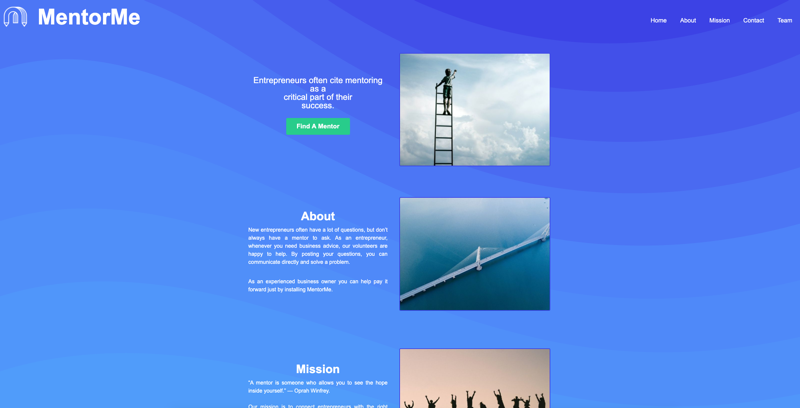

# Mentor Me Landing Page

Showcasing our skills learned so far in Lambda School. Creating a community for entrepreneurs fictitious website.

## Table of Contents

- [Screenshot](#screenshot)
- [Pitch](#pitch)
- [Goal](#goal)
- [Getting Started](#getting-started)

## Screenshot

## Pitch:

Be My Mentor lets you lend your business skills to an entrepreneurs across the globe. New entrepreneurs often have a lot of questions, and don’t always have a mentor to ask. As an entrepreneur, whenever you need business advice, our volunteers are happy to help. By posting your questions, you can communicate directly and solve a problem. As an experience business owner you can help pay it forward just by installing the Be My Mentor app.

## Goal:

1.  An on-boarding process for an entrepreneur
2.  On-boarding process for a volunteer experienced business owner
3.  Ability to easily create and post a question (including title, question, tagged business type, and optional photos/files)
4.  Ability to easily edit / delete a question
5.  Ability for anyone to easily search / find posted questions
6.  Ability to respond to a posted question via message
7.  Use a notification API like Twilio (https://www.twilio.com/) or Growl (http://growl.info/) to allow volunteers to be notified when a question is posted in their business type.

## Getting Started:

- For this repository to your local machine
- Open index.html
- All image assets are in the assets folder.
